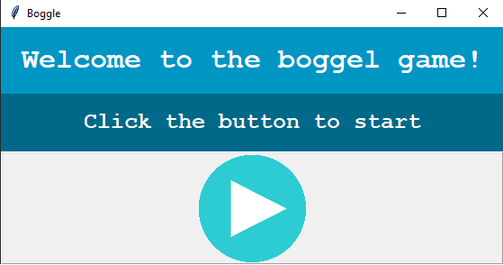
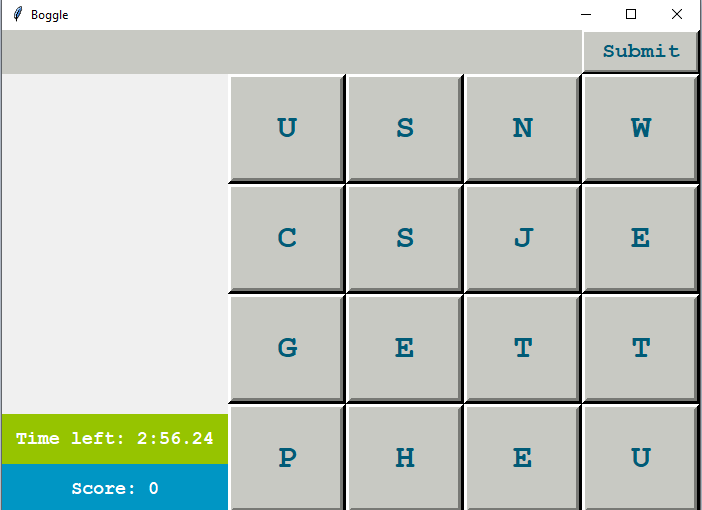

# Boggle

This game developed as part of the course intro to computer science in the
heberw university of jerusalem. You can fine here the main script that run the
game, the game model and the game gui as long as the game utils.

## Running the game

Just clone the repo and run with your favorite IDE

## Playing the game

The game has a starting screen as shown below:
 

 
After clicking the arrow a counter will start and the game will be opened. In
the following image you can see the game screen:
 

 
In the main screen you can see:

- The time left for the current game session
- The score accumulated so far
- Guessed words (the white box)
- Letters board
- Current word guessing

### Game rules
The player searches for words that fit the following criteria (under a time limit of two minutes):

Words must be at least three letters in length. Each letter after the first
must be a horizontal, vertical, or diagonal neighbor of the one before it. No
individual letter cube may be used more than once in a word. No capitalized or
hyphenated words are allowed. Multiple forms of the same word are allowed, such
as singular/plural forms and other derivations.

Rules adopted from wikipedia [wikipedia](https://en.wikipedia.org/wiki/Boggle)

## Enjoy :)